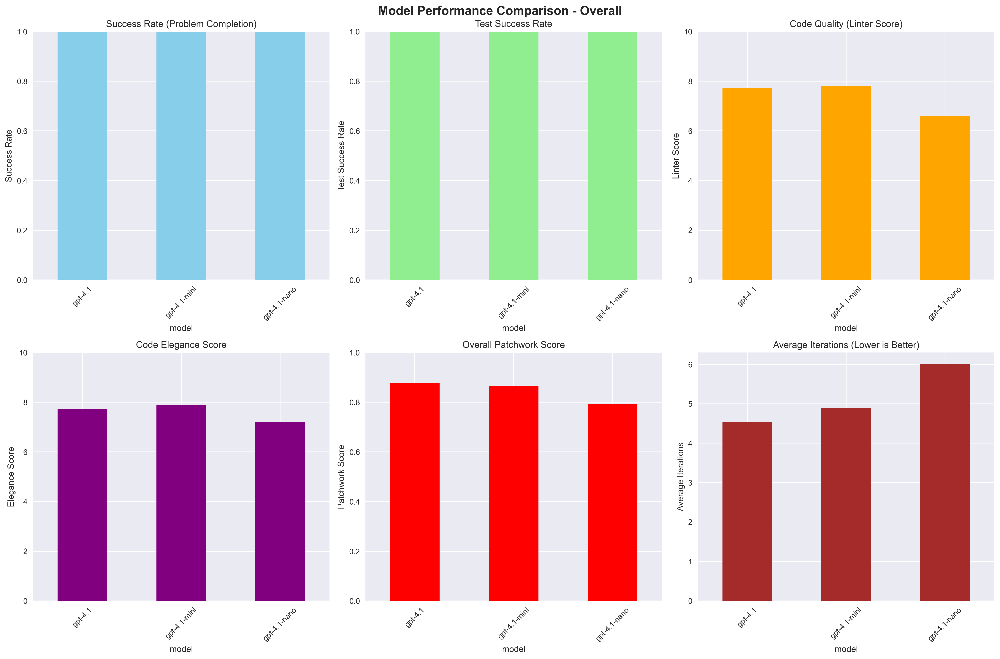
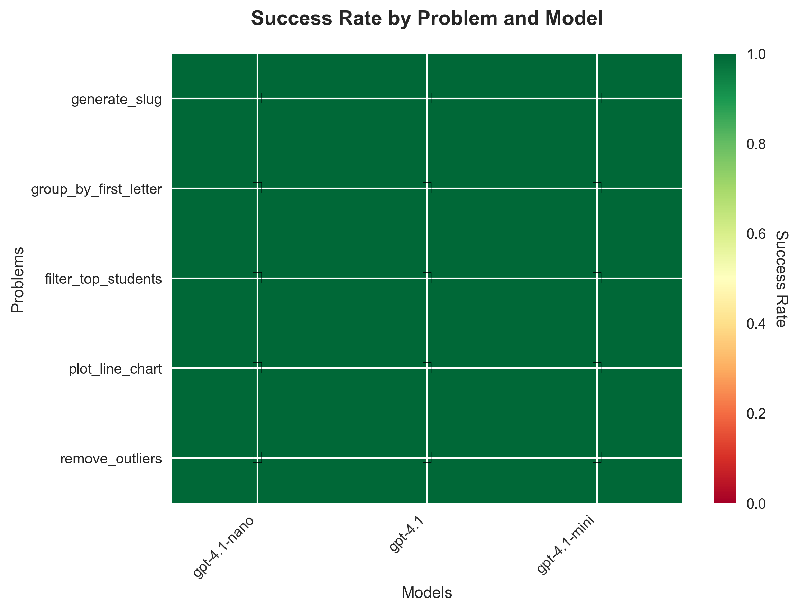

<div align="center">
  
  
# Patchwork 🔧
  
  An intelligent code debugging agent that automatically fixes broken Python functions using LLM-powered iterative refinement.
</div>

## Overview

Patchwork is a Python framework for automated code debugging and repair. It combines large language models with dynamic tool execution to iteratively analyze, test, and fix broken code. The agent can handle complex debugging scenarios including performance optimization, plotting functions, and algorithmic corrections using multiple specialized tools.

## Features

- 🤖 **LLM-Powered Debugging**: Uses GPT-4.1 series models for intelligent code analysis and repair
- 🔄 **Iterative Refinement**: Automatically iterates through fix attempts until success or timeout
- 🛠️ **Comprehensive Tool Suite**: Extensible tool system with 4 specialized debugging tools
- 📊 **Multi-Level Evaluation**: 3-tier evaluation framework (deterministic, objective, and LLM-based scoring)
- 🎯 **Best-of-N Sampling**: Generate multiple solutions and pick the best one
- 📈 **Results Visualization**: Built-in plotting and analysis tools for performance comparison
- ⚡ **Flexible Configuration**: Support for different models, temperatures, and iteration limits
- 🧪 **Rich Test Dataset**: 5 diverse problem types covering common debugging scenarios

## Installation

```bash
# Clone the repository
git clone https://github.com/tejaskhot/patchwork.git
cd patchwork

# Install dependencies using uv (recommended) or pip
uv sync
# OR
pip install -e .

# Set up your API key
export OPENAI_API_KEY="your_api_key_here"
```

## Quick Start

### Basic Usage

```python
from agent import create_agent, ProblemContext

# Create an agent
agent = create_agent(
    model="gpt-4.1-nano",  # or gpt-4.1-mini, gpt-4.1
    max_iterations=5,
    temperature=0.1
)

# Define your problem
problem = ProblemContext(
    entry_point="fibonacci",
    goal="Fix the fibonacci function to be efficient for large inputs",
    quality_criteria="Must handle n=30 in under 1 second",
    tests_formatted="fibonacci(5) should return 5, fibonacci(10) should return 55",
    broken_code="""
def fibonacci(n):
    if n <= 1:
        return n
    return fibonacci(n-1) + fibonacci(n-2)  # Too slow!
"""
)

# Run the agent
solution = agent.run(problem)
print(solution)
```

### Command Line Interface

```bash
# Run with built-in test problems
python run_patchwork.py --problem filter_top_students --model gpt-4.1-nano
python run_patchwork.py --problem plot_line_chart --model gpt-4.1-mini

# List all available test problems
python run_patchwork.py --list-problems

# Run with custom parameters
python run_patchwork.py --problem remove_outliers --model gpt-4.1 --max-iterations 10

# Batch testing with multiple problems
python run_patchwork.py --batch --model gpt-4.1-nano
```

### Results Analysis and Visualization

```bash
# Generate performance comparison plots
python plot_results.py --model-comparison

# Create per-problem heatmaps
python plot_results.py --heatmap

# Analyze specific model performance
python plot_results.py --model gpt-4.1-nano --problems
```

## Model Options

### GPT-4.1 Series (Tested in the experiments so far)

- `gpt-4.1-nano` - Smallest, fastest, most cost-effective (best for simple problems)
- `gpt-4.1-mini` - Balanced performance and cost (recommended for most use cases)
- `gpt-4.1` - Most capable, highest quality (complex debugging scenarios)

### Other Supported Models via LiteLLM

Patchwork supports any model available through [LiteLLM](https://docs.litellm.ai/docs/providers), including models from OpenAI, Anthropic, Google, Cohere, Hugging Face, and many other providers. Simply use the appropriate model identifier when creating your agent.

## Architecture

### Core Components

- **PatchworkAgent**: Main agent class orchestrating the debugging process via ReAct pattern
- **ToolRegistry**: Dynamic tool discovery and management system
- **ProblemContext**: Structured representation of debugging problems with validation
- **Multi-Level Evaluator**: Comprehensive 3-tier evaluation framework

### Available Tools

The agent automatically discovers and uses these specialized debugging tools:

1. **`run_tests`** - Primary tool for verifying code correctness by executing code against test cases in a secure, isolated subprocess. Compares function output against expected results and returns formatted test summaries.

2. **`lint`** - Static code analysis using pylint to identify errors, style violations, and potential bugs without executing code. Returns quality scores (0-10) and specific issue reports to help improve code quality and Python best practices adherence.

3. **`run_with_debugger`** - Deep execution analysis tool that uses Python's `sys.settrace` to provide insight into failing test cases. Pinpoints exact error locations, captures local variable states at failure points, and provides detailed execution traces for understanding why code is broken.

4. **`inspect_plot`** - Specialized matplotlib validation tool that executes plotting code using non-interactive 'Agg' backend. Inspects generated plot objects for visual properties like titles, axis labels, line colors, and styles without rendering images, enabling automated visual debugging.

### Evaluation Framework

#### Level 1: Primary Deterministic Rewards

- **Success Rate**: Binary completion (1.0 if all tests pass)
- **Completion Rate**: Percentage of individual tests passed
- **Efficiency Score**: Inverse relationship to tool calls used

#### Level 2: Secondary Objective Rewards  

- **Invalid Action Penalty**: Deductions for tool errors or failures
- **Regression Penalty**: Penalties for decreasing test pass rates
- **Linter Score**: Objective code quality assessment (0-10 scale)

#### Level 3: Tertiary Subjective Rewards

- **Code Elegance Score**: LLM-based assessment of code quality and style
- **Strategic Efficiency Score**: LLM evaluation of debugging approach quality

**Unified Patchwork Score**: Combines all metrics into single performance measure

## Test Dataset

The framework includes 5 diverse problem types:

1. **`filter_top_students`** - List filtering and sorting
2. **`group_by_first_letter`** - Dictionary grouping with normalization  
3. **`plot_line_chart`** - Matplotlib visualization with styling
4. **`remove_outliers`** - Statistical analysis and outlier detection
5. **`generate_slug`** - String processing and URL slug generation

Each problem includes:

- Broken reference implementation
- Comprehensive test cases
- Quality criteria for evaluation
- Expected outputs for validation

## Configuration

### Environment Variables

```bash
export OPENAI_API_KEY="your_openai_key"
export ANTHROPIC_API_KEY="your_anthropic_key"  # Optional, for Claude models
export VERBOSE=1  # Enable detailed logging
export DEBUG_LITELLM=1  # Enable LiteLLM debug logs
```

### Custom Tool Development

```python
from tools.registry import ToolRegistry

# The registry automatically discovers tools
# Add new tools to the tools/ directory following the existing pattern

def my_custom_tool(code: str, context: str) -> str:
    """
    Custom debugging tool description.
    
    Args:
        code: The code to analyze
        context: Additional context for analysis
        
    Returns:
        Analysis results as string
    """
    # Your tool implementation
    return "analysis results"

# Tools are automatically registered when placed in tools/ directory
```

## Examples

See `example_usage.py` for comprehensive examples including:

- Basic fibonacci optimization with error handling
- Custom tool registry usage and dependency injection
- Best-of-N sampling with temperature control
- Advanced logging and session statistics

## Evaluation and Benchmarking

```python
from evals import PatchworkEvaluator

# Evaluate a single solution
evaluator = PatchworkEvaluator()
metrics, patchwork_score = evaluator.evaluate(
    run_log=agent.get_run_log(),
    test_cases=test_cases,
    original_code=broken_code,
    entry_point="function_name"
)

print(f"Success Rate: {metrics.success_rate:.1%}")
print(f"Patchwork Score: {patchwork_score.score:.4f}")
```

## Results Storage

Results are automatically organized by model:

```
results/
├── gpt-4.1-nano/
│   ├── run_log_problem_name_timestamp.json
│   └── batch_summary_timestamp.json
├── gpt-4.1-mini/
└── gpt-4.1/
```

Each result file contains:

- Complete debugging session logs
- Tool call history with structured results
- Evaluation metrics and scores
- Timestamps and metadata

## Dependencies

Core dependencies managed in `pyproject.toml`:

- **LiteLLM**: Multi-provider LLM access
- **Pydantic**: Data validation and settings management
- **Matplotlib/Seaborn**: Plotting and visualization
- **Pandas/NumPy**: Data analysis and manipulation
- **Pylint**: Code quality analysis

## Contributing

1. Fork the repository
2. Create a feature branch (`git checkout -b feature/amazing-feature`)
3. Make your changes following the existing patterns
4. Run tests and ensure code formatting with Black
5. Submit a pull request

## License

MIT License - see LICENSE file for details.

---

## Performance Benchmarks

### Model Comparison Results



### Per-Problem Performance Heatmap



Generate updated performance visualizations by running:

```bash
python plot_results.py --model-comparison
python plot_results.py --heatmap
```

*Results are based on experimental runs with the built-in test dataset. Performance may vary based on problem complexity, model configuration, and other factors.*
